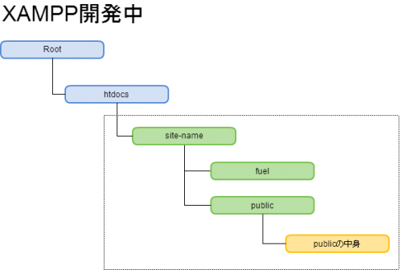
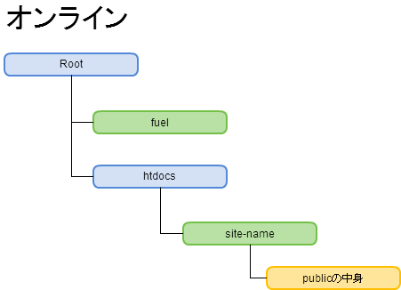

FuelPHP開発でローカルとWebで構造が変わっても対応できる小技
==========================================================

こんにちはタケ（[@LandscapeSketch](https://twitter.com/LandscapeSketch)）です。

FuelPHP Advent Calender 2013の記事を書いています。昨日は[@koyhoge](https://twitter.com/koyhoge)さんの「[JavaScript側にPHP変数を簡単にまるごと渡す方法](http://d.hatena.ne.jp/koyhoge/20131206)」でした。

今日は「**FuelPHP開発でローカルとWebで構造が変わっても対応できる小技**」として、ローカルとWeb上でディレクトリ構造を変えていても便利に開発できる小技を紹介します。

## 開発環境とWeb上の構造

現在、ローカルではWindows、XAMPP、NetBeansの組み合わせで開発しています。  
 ローカルでは1つのプロジェクトディレクトリに全てを入れ管理を行います。

図1 ローカル開発環境

 

Web上では安全のために fuelphp/public の中身のみを公開ディレクトリに入れ、fuelphp/fuel は非公開エリアに移動しようと思いました。

図2 オンライン公開状態

しかしNetBeansでは**プロジェクトディレクトリ以下に入っているファイルしか管理できません**。サイト名のメインディレクトリがあり、その下にfuel、public両方が入っている必要があります。（図１の点線部分）

Webと同じ構造にするとNetBeansで管理できなくなってしまうのです。

となると**デプロイするたびに設定を書き換えてアップロード**する必要性が出てきます。手間がかかり、もし書き忘れた場合はエラー画面となってしまいます。

## index.phpを柔軟にする

いろいろ試した結果、public/index.php を書き換えることで良い感じになりました。

 

public/index.phpを開くとFuelPHPで使用するディレクトリパスの設定部分があります。

通常では

PHP

define('APPPATH', realpath(DIR . '/../fuel/app/' ).DIRECTORY\_SEPARATOR);

1

define('APPPATH', realpath(DIR . '/../fuel/app/' ).DIRECTORY\_SEPARATOR);

のように /../fuel/app/ の部分が固定されています。

 

まずこの部分を変数に置き換えます。 /../ を $fueldir に定義しています。

PHP

define('APPPATH', realpath(DIR . $fueldir . '/app/') . DIRECTORYSEPARATOR);

1

define('APPPATH', realpath(DIR . $fueldir . '/app/') . DIRECTORYSEPARATOR);

## .htaccessに仕掛け

次にそれぞれの環境の .htaccess にfuelの環境設定を書き加えます。

ローカル  
 **SetEnv FUEL\_ENV development**

Web  
 **SetEnv FUEL\_ENV production**

## 再度index.php

再度 public/index.php に以下の構文を加えました。

PHP

if ( $\_SERVER['FUEL\_ENV'] == 'production' ) { $fuel\_dir = '/../../fuel'; ini\_set('display\_errors', 0); } elseif( $\_SERVER['FUEL\_ENV'] == 'development' ) { $fuel\_dir = '/../fuel'; ini\_set('display\_errors', 1); }

1

2

3

4

5

6

7

if ( $\_SERVER['FUEL\_ENV'] == 'production' ) {

  $fuel\_dir = '/../../fuel';

  ini\_set('display\_errors', 0);

} elseif( $\_SERVER['FUEL\_ENV'] == 'development' )  {

  $fuel\_dir = '/../fuel';

  ini\_set('display\_errors', 1);

}

$fuel\_dir に環境ごとの fuel ディレクトリ位置を代入しています。その後は各グローバル変数に代入されていきます。

 

また同時に

PHP

iniset('displayerrors', 0);

1

iniset('displayerrors', 0);

などエラー表示設定を書いておくことで、公開した時に内部エラーが丸見えにならないようにもできました。

## まとめ

ごく簡単なTipsでしたがいかがでしたでしょうか？

ただこれは私の考えた方法で、もっと簡潔で安全な方法もあるかと思います。もし「こんなふうに書くともっと簡単だよ！」という方法がありましたら、**ぜひコメントしてください！**

 

あすは@sa2yasuさんの「FuelPHPを更に使ってみて使えるなと思ったCustomValidationRuleの書き方とCore拡張の小技」です。お楽しみに～

 

（文中のソースコードはすべてBSDライセンスといたします。）
