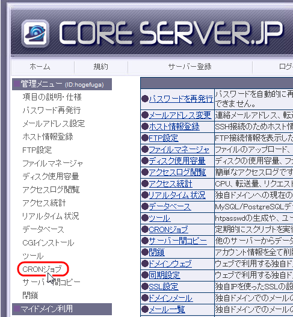

レンタルサーバーXREA/CORESERVERでFuelPHPを使う（実践編）
==========================================================================================

この記事は [FuelPHP Advent Calendar 2013](http://atnd.org/events/45096) の 17 日目の記事として公開します。なお、昨日は hosopy さんの「[FuelPHPのmoduleを使いこなす](http://qiita.com/hosopy/items/0428be74f1c3868c55ba)」でした。

先々月に「[レンタルサーバー XREA/CORESERVER で FuelPHP を動かす](http://d.hatena.ne.jp/suno88/20131006/1381040481)」という記事を書きました。今回はその続きとして、もう少し実践的な内容をお届けします。前回の記事と併せてお読みください。

本稿の内容は s110.coreserver.jp 上の PHP 5.4.21 で FuelPHP 1.7.1 を使って動作確認をしてあります。以降、ユーザー名を hogefuga、サーバーを s1024.coreserver.jp と仮定して説明します。みなさんのアカウント情報に適宜読み換えながら試してみてください。

  

ローカルの開発環境でデータベースを使う
------------------------------------------------------------------------------------------------------------

XREA/CORESERVER では MySQL と PostgreSQL が利用可能ですが、セキュリティーの理由からか、同一サーバーからのアクセス以外は弾かれるようで、ローカルの開発環境からサーバー上のデータベースを読み書きすることはできません。そこで開発用のデータベースをローカルに立て、ローカル環境ではローカルデータベースを、サーバー上の運用環境ではサーバーのデータベースを参照するようにしましょう。

まず、サーバー上の環境を production (運用環境)に設定しましょう。FuelProject/public/.htaccess の先頭、「AddHandler application/x-httpd-php54cgi .php」の上あたりに、次の行を追加します。

    SetEnv FUEL_ENV production

.htaccess はローカルとサーバーでは記述が異なるので、不用意な上書きに注意してください。

これでローカル環境は development、サーバー環境は production と別々の FUEL\_ENV が設定されました。では、それぞれの環境用に db.php を作ります。

私は PostgreSQL が好きなので、基本的にサーバーにも PostgreSQL でデータベースを作成しています。ここでは PostgreSQL の例を挙げますが、MySQL でも同様に設定できますので、参考にしてください。

まず、fuel/app/config/db.php に共通設定を書きます。

    <?php

    return [
        'default' => [
            'type' => 'pdo',
            'identifier' => '',
            'table_prefix' => '',
            'charset' => 'utf8',
            'enable_cache' => true,
            'profiling' => false,
        ],
    ];

続いてサーバー側の設定を fuel/app/config/production/db.php に記述しましょう。ホスト名は s1024.coreserver.jp とせず、localhost にします。

    <?php

    return [
        'default' => [
            'connection' => [
                'dsn'        => 'pgsql:host=localhost;dbname=hogefuga',
                'username'   => 'hogefuga',
                'password'   => 'your_password',
                'persistent' => false,
                'compress'   => false,
            ],
        ],
    ];

同様に、ローカル環境の設定を fuel/app/config/development/db.php に記述します。

    <?php

    return [
        'default' => [
            'connection' => [
                'dsn'        => 'pgsql:host=localhost;dbname=hogefuga_local',
                'username'   => 'hogefuga_local',
                'password'   => 'your_local_password',
                'persistent' => false,
                'compress'   => false,
            ],
        ],
    ];

ローカルに立てたデータベースの DB 名とユーザー名、パスワードをサーバーのものと同じにすれば設定を分けずに済みますが、ローカル環境で複数のデータベースを切り替えて開発できるようにしておくほうがよいでしょう。

  

タスクと Email パッケージを利用してログファイルの肥大化を防ぐ
-------------------------------------------------------------

fuel/app/logs に日々蓄積されるログファイルを、FuelPHP を使って定期的に掃除させましょう。

次のような仕様を考えます。

-   日付が変わったら、前日のログファイルをメールで送信する。
-   1 週間前のログファイルは削除する。その際、カラになったディレクトリも削除する。

cron ジョブによるバッチ処理を毎晩走らせましょう。FuelPHP ではタスクという機能でバッチ処理が実現できます。

適当なプロジェクトを作成し、fuel/app/tasks/logsender.php というファイルを作成します。プロジェクトの設置場所は `~/php/logsender` とします。

    <?php

    /**
     * FuelPHP の前日分ログファイルをメールで送信し、1 週間前のログファイルを削除するタスク。
     */

    namespace Fuel\Tasks;

    \Package::load('email');

    /**
     * ログのメール送信と古いログの削除を行うクラス。
     */
    class LogSender
    {
        /**
         * バッチ本体
         */
        public static function run()
        {
            // メールヘッダー情報
            $address_from = 'hogefuga@s1024.coreserve.jp';
            $name_from = 'FuelPHP Task';
            $address_to = 'hogefuga@s1024.coreserver.jp';
            $name_to = '俺';

            $yesterday = date('Y/m/d', time() - 86400);
            $one_week_ago = date('Y/m/d', time() - 86400 * 7);

            $log_dir = '/virtual/hogefuga/php/logsender/fuel/app/logs/';
            $yesterday_log_name = $log_dir . $yesterday . '.php';

            // メール送信
            $subject = "FuelPHP Log - $yesterday.php";

            $email = \Email::forge();
            $email->from($address_from, $name_from);
            $email->to($address_to, $name_to);
            $email->subject($subject);
            if (file_exists($yesterday_log_name)) {
                $email->body('');
                $email->attach($yesterday_log_name);
            } else {
                $email->body('昨日のログファイルはありません。');
            }
            try {
                $email->send();
            } catch (Exception $ex) {

            }
                    
            // 1 週間前のログを削除
            $log_to_delete = $log_dir . $one_week_ago . '.php';
            if (file_exists($log_to_delete)) {
                if (!unlink($log_to_delete)) {
                    echo 'ファイル削除に失敗' . PHP_EOL;
                }
                self::remove_directory(dirname($log_to_delete));
                self::remove_directory(dirname(dirname($log_to_delete)));
            }
        }
        
        
        /**
        * ディレクトリを削除する。ディレクトリ内にファイルがある時は何もしない。
        * @param string $dir  ディレクトリ名
        */
       private static function remove_directory($dir)
       {
           $files = scandir($dir);
           if (count($files) === 2) {
               rmdir($dir);
           }
        }
    }

このタスクをコマンドラインから実行する際、以下のコマンドではエラーが返ってきます。

    php ~/php/logsender/oil r logsender

本稿執筆時点では XREA (一部のサーバーを除く)と CORESERVER は PHP のバージョンが 5.2 なので、FuelPHP は動かないのでした。PHP をフルパスで指定しましょう。

ここでサーバーにログインし[\*1](/suno88/20131217/1387285818#20131217f1 "「レンタルサーバー XREA/CORESERVER で FuelPHP を動かす」の「3. シンボリックリンクの作成」を参照してください。")、ホームディレクトリで `ls /usr/local/bin/php*` を実行してみてください。以下のような表示になると思います。

    hogefuga@s1024:~> ls /usr/local/bin/php*
    /usr/local/bin/php           /usr/local/bin/php-5.2.4cli   /usr/local/bin/php-5.4.19cli  /usr/local/bin/php55-config
    /usr/local/bin/php4          /usr/local/bin/php-5.2.5      /usr/local/bin/php-5.4.21     /usr/local/bin/php55ize
    /usr/local/bin/php-4.4.7     /usr/local/bin/php-5.2.5cli   /usr/local/bin/php-5.4.21cli  /usr/local/bin/php5cli
    /usr/local/bin/php-4.4.7cli  /usr/local/bin/php52cli       /usr/local/bin/php-5.4.5      /usr/local/bin/php5-config
    /usr/local/bin/php-4.4.8     /usr/local/bin/php53          /usr/local/bin/php-5.4.5cli   /usr/local/bin/php5ize
    /usr/local/bin/php-4.4.8cli  /usr/local/bin/php-5.3.15     /usr/local/bin/php-5.4.7      /usr/local/bin/php6
    /usr/local/bin/php4cli       /usr/local/bin/php-5.3.15cli  /usr/local/bin/php-5.4.7cli   /usr/local/bin/php6cli
    /usr/local/bin/php4-config   /usr/local/bin/php-5.3.17     /usr/local/bin/php54cli       /usr/local/bin/php6-config
    /usr/local/bin/php4ize       /usr/local/bin/php-5.3.17cli  /usr/local/bin/php54-config   /usr/local/bin/php6ize
    /usr/local/bin/php5          /usr/local/bin/php-5.3.27     /usr/local/bin/php54ize       /usr/local/bin/php_back
    /usr/local/bin/php52         /usr/local/bin/php-5.3.27cli  /usr/local/bin/php55          /usr/local/bin/php-cgi
    /usr/local/bin/php-5.2.2     /usr/local/bin/php53cli       /usr/local/bin/php-5.5.3      /usr/local/bin/php-config
    /usr/local/bin/php-5.2.2cli  /usr/local/bin/php53-config   /usr/local/bin/php-5.5.3cli   /usr/local/bin/phpize
    /usr/local/bin/php-5.2.3     /usr/local/bin/php53ize       /usr/local/bin/php-5.5.5
    /usr/local/bin/php-5.2.3cli  /usr/local/bin/php54          /usr/local/bin/php-5.5.5cli
    /usr/local/bin/php-5.2.4     /usr/local/bin/php-5.4.19     /usr/local/bin/php55cli
    hogefuga@s1024:~>

FuelPHP の実行には PHP 5.3 以上であればいいので、好きなバージョンの PHP を指定しましょう。

    /usr/local/bin/php-5.5.5cli ~/php/logsender/oil r logsender

これを実行するシェルスクリプトを適当な場所に設置します。ここでは \~/cron\_logsender.sh として置くことにします。改行コードを LF にするのを忘れないようにしてください。

    #!bin/sh
    /usr/local/bin/php-5.5.5cli ~/php/logsender/oil r logsender
    exit

これを cron ジョブで起動するように設定します。CORESERVER のコントロールパネルにログインして、左メニューの「CRON ジョブ」をクリックし、「CRON ジョブの編集」画面を開きます。

  

空いている設定欄に、以下のように入力します。

-   分 → 30
-   時 → 0
-   日 → \*
-   月 → \*
-   曜日 → \*

その下にある「/virtual/hogefuga/」に続くテキストボックスには、

    cron_logsender.sh > /dev/null 2>&1

と入力します。これで、毎日 0:30 に先ほどのタスクが実行されます。

メール送信時にエラーが発生したときの処理などは、みなさんで追加してみてください。

### 【12/18 追記】

添付ファイルのサイズの制限について、[Fumito Mizuno さんから質問をいただきました](https://twitter.com/ounziw/status/413225966786199552)。公式発表はないようなので、実際にどのくらいまで添付で送れるか、簡単なコードを書いて調べてみました。

1MB から 1MB 刻みで添付ファイルのサイズを増やして送信したところ、こんなエラーメッセージが出ました。

> Fatal error: Allowed memory size of 94371840 bytes exhausted (tried to allocate 28329953 bytes) in /virtual/hogefuga/php/logsender/fuel/packages/email/classes/email/driver.php on line 965  
>
> Fatal Error - Allowed memory size of 94371840 bytes exhausted (tried to allocate 28329953 bytes) in PKGPATH/email/classes/email/driver.php on line 965

19MB の添付ファイルがついたメールまでは届きましたが、20MB の添付ファイルつきのメールは届きませんでした。サーバーによって差はあると思いますが、ログが 20MB 以上になると厳しいかもしれません。

本当はログファイルを ZIP 圧縮してから添付したいのですが、XREA/CORESERVER では ZipArchive クラスが使えないので、非圧縮のまま添付しています。

終わりに
--------

この記事を最初に書いたとき、メール送信部分は素の PHP で、ログの内容をメール本文として mb\_send\_mail() で送信するコードでした。書き終えた後、「FuelPHP のアドベントカレンダーなのに FuelPHP 成分が少ないぞ」と思い直し、使ったこともない Email パッケージで送信するコードを書き始めたところ、ものの 5 分程度で添付ファイルつきのメールを送信するコードが動いてしまい、ますます FuelPHP が気に入ってしまいました。

次回は [@mamor](https://twitter.com/madmamor) さんの「[FuelPHPとMongoDBとTraceKitでJavaScriptのエラー情報を収集してみる](http://madroom-project.blogspot.jp/2013/12/fac20131218.html)」です。
